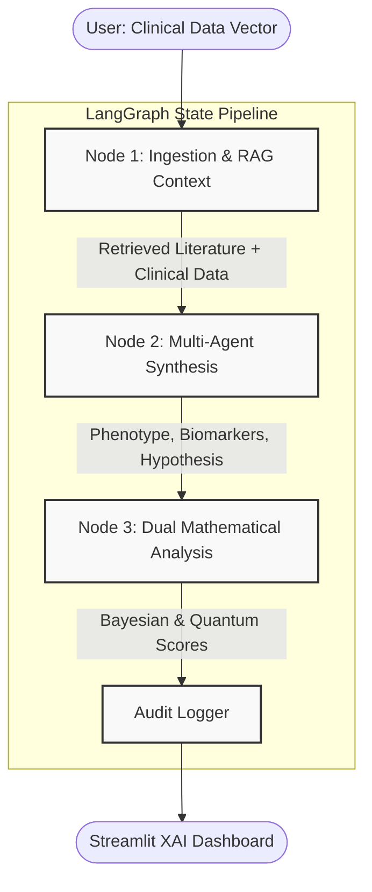

# Multi-Agent XAI Biomedical Hypothesis Analysis System

## 🔬 System Overview
This project presents an advanced **Multi-Agent Explainable AI (XAI) Diagnostic Framework** designed for the analysis of Polycystic Ovary Syndrome (PCOS). Built using `LangGraph` for stateful execution, the system models the clinical diagnostic process as an iterative, multi-node computational graph. 

Instead of relying on a single Large Language Model (LLM) which is susceptible to hallucinations and biases, this architecture employs Retrieval-Augmented Generation (RAG) for biomedical literature grounding, Multi-Agent Consensus for hypothesis generation, and Dual Mathematical Evaluation (Classical Bayesian & Simulated Quantum) to computationally verify the integrity and confidence of the generated clinical hypothesis.

This serves as a transparent decision-support tool where the entire "thought process" of the AI—from literature retrieval to probability scoring—is rendered accessible and explainable to the clinician.

---

## Pipeline Architecture: The Execution Nodes

The system operates over a deterministic state graph defined by three core computational nodes and an auditing mechanism:

### **Node 1: Ingestion & Hybrid Context Retrieval (RAG)**
* **Functional Role:** Processes the raw clinical profile (Age, Presentation, LH/FSH Ratio, Fasting Insulin).
* **Technical Implementation:** Serves as a Retrieval-Augmented Generation (RAG) engine. It queries an embedded biomedical knowledge base (e.g., PubMed abstracts) to extract contextually relevant literature fragments. This ensures the subsequent agents are constrained by empirically validated medical research rather than generalized pre-training data.

### **Node 2: Multi-Agent Clinical Hypothesis Synthesis**
* **Functional Role:** Analyzes the structured clinical data against the retrieved biomedical context to generate a formalized clinical hypothesis.
* **Technical Implementation:** A multi-agent consensus layer that parses the inputs to classify the specific PCOS phenotype, identify the primary risk vector, and propose exploratory biomarkers. It outputs a structured JSON object representing the consensus hypothesis and initial agent confidence metrics.

### **Node 3: Dual Analysis & Mathematical Integrity Evaluation**
* **Functional Role:** Subjects the AI-generated hypothesis to rigorous mathematical scrutiny to prevent overconfidence and provide explainability.
* **Technical Implementation:**
    1. **Bayesian Prior Update (Classical):** Calculates a statistical credibility score and posterior interval bounds using Beta distributions, offering a probabilistic measure of the hypothesis's reliability.
    2. **Quantum Plausibility Weighting (Simulated):** Leverages quantum state distribution simulations (sub-circuit basis pattern density) as a proxy metric for hypothesis complexity and structural plausibility.

### **Node 4: Payload Assembly & Schema Verification**
* **Functional Role:** Validates structural data and mathematical metrics from Nodes 1, 2, and 3.
* **Technical Implementation:** Ensures pipeline schema alignment before handing off the consolidated diagnostics to the Explainable AI engine.

### **Node 5: Explainable AI Engine & Quantum Decoding**
* **Functional Role:** Generates human-readable game-theoretic explanations and interprets mathematical constraints.
* **Technical Implementation:** Computes official KernelSHAP feature attributions using an extended background matrix and compiles the final Clinical Diagnostic Dossier.

### **Node 6: Reinforcement Learning (RL) Policy Ranker**
* **Functional Role:** Evaluates the Multi-Agent strategy and optimizes the execution loop.
* **Technical Implementation:** Uses temporal-difference Q-learning to reward or penalize upstream prompts based on diagnostic entropy. Includes hard loop guardrails to prevent recursive inference.

*(Note: An `AuditInterceptorNode` ensures all state transitions and metric outputs are logged into a persistent audit trail for compliance and review).*

---

##  Computational Graph Flowchart

---

## Academic Defense: Potential Cross-Questioning

If you are presenting this to a professor or evaluation committee, anticipate the following technical questions:

**Q1: What is the architectural advantage of using a Multi-Agent system over a single advanced LLM for diagnosis?**
* **Defense:** A single LLM acts as a monolithic black box, prone to compounding errors and hallucinations, particularly in highly specialized domains like biomedicine. A multi-agent architecture introduces compartmentalization and consensus-building. By dividing the workload (e.g., one agent focusing on literature retrieval, another on phenotypic classification), we mimic a multidisciplinary medical board, yielding hypotheses that are cross-validated and significantly more robust.

**Q2: How does the RAG implementation in Node 1 fundamentally improve the safety of this system?**
* **Defense:** LLMs generate text based on probabilistic word associations derived from their training data, which can be outdated or generalized. Retrieval-Augmented Generation (RAG) acts as an empirical constraint. By dynamically querying a vector database of validated biomedical literature (like PubMed) and injecting those specific abstracts into the prompt context, we anchor the model's generation to cited scientific consensus, drastically reducing the risk of clinical hallucination.

**Q3: Explain the utility of the Dual Analysis (Node 3). Why do we need Bayesian scoring if the AI already outputs a "confidence level"?**
* **Defense:** LLMs are notoriously poor at self-evaluating their own uncertainty; an LLM might output a completely fabricated claim with "99% confidence." The Dual Analysis node serves as a deterministic mathematical overlay. The Bayesian evaluation calculates a rigorous statistical credibility score independent of the LLM's semantic output. This provides the clinician with an objective, mathematically derived confidence metric rather than relying on the LLM's subjective self-assessment.

**Q4: You mention "Quantum Plausibility Weighting." Is this system executing on actual quantum hardware, and what does this metric actually represent?**
* **Defense:** The current implementation utilizes a simulated quantum sub-circuit executed on classical architecture. It is an experimental approach to evaluating the complexity and state distribution of the generated data vectors. By mapping the hypothesis variables to quantum states and observing the basis pattern density, we derive a "plausibility weight." While not a physical quantum computer, the mathematics provide a novel, high-dimensional perspective on the structural integrity of the AI's conclusion.

**Q5: In the context of Explainable AI (XAI), how does this system address the "black box" problem typical in medical AI?**
* **Defense:** Traditional predictive AI outputs a binary diagnosis with no insight into *why*. Our system is fundamentally explainable because the state transitions are exposed at every node. A clinician can view exactly which literature fragments were retrieved (Node 1), read the explicit reasoning behind the phenotype classification (Node 2), and review the raw mathematical evaluation scores (Node 3). The dashboard renders the entire analytical pipeline transparent, supporting clinician agency rather than replacing it.