# Complete System Architecture: Multi-Agent XAI PCOS Diagnostic Pipeline

> **All formulas, thresholds, and data flows are matched 1:1 to the actual source code.**

---

## Master Architecture Flowchart

```mermaid
graph TB
    %% ===== INPUT =====
    USER(["👩‍⚕️ CLINICIAN INPUT<br/>age, BMI, LH/FSH, insulin,<br/>testosterone, AMH, remarks"])

    %% ===== NODE 1: INGESTION =====
    subgraph N1["INGESTION & HYBRID RAG RETRIEVAL"]
        direction TB
        N1A["Schema Normaliser<br/>Flatten nested labs dict<br/>to top-level keys"]
        N1B["SciSpacy NER<br/>en_ner_bc5cdr_md<br/>+ Bidirectional Negation Guard<br/>30-char lookback / 40-char lookahead<br/>Stop: no, normal, negative, clear"]
        N1C["Dynamic Query Builder<br/>Boolean: PCOS AND symptoms<br/>+ Threshold triggers:<br/>Insulin ≥ 14.0 → hyperinsulinemia<br/>LH/FSH ≥ 2.0 → lh-fsh ratio"]
        N1D["Neo4j KG Traversal<br/>Cypher: MATCH path up to 4 hops<br/>PCOS → DRIVES → Phenotypes<br/>Returns edge list"]
        N1E["Corpus Loader<br/>Tier 1: Live PubMed API<br/>Tier 2: pubmed_cache.json<br/>Tier 3: pcos_literature_corpus.json"]
        N1F["Hybrid RAG Ranker<br/>BM25 Okapi (sparse)<br/>+ MiniLM-L6-v2 (dense cosine)<br/>→ Reciprocal Rank Fusion<br/>RRF = 1/(60+rank_BM25) + 1/(60+rank_Dense)<br/>Top-5 deduplicated chunks"]

        N1A --> N1B --> N1C --> N1E --> N1F
        N1B --> N1D
    end

    %% ===== NODE 2: MULTI-AGENT DEBATE =====
    subgraph N2["MULTI-AGENT CONSENSUS DEBATE (CrewAI)"]
        direction TB
        N2A["Reproductive Endocrinologist<br/>Rotterdam phenotype classification<br/>Oligomenorrhea + Hyperandrogenism<br/>+ Polycystic Morphology"]
        N2B["Metabolic Pathway Specialist<br/>HOMA-IR, BMI, Fasting Insulin<br/>Insulin resistance risk scoring"]
        N2C["Clinical Differential Expert<br/>Mimic identification:<br/>CAH, Thyroid, Prolactinoma<br/>Missing test flagging"]
        N2D["Consensus Harmonizer<br/>JSON schema validation<br/>Source citation linking<br/>Mismatch correction layer"]

        N2A -->|Sequential| N2B -->|Sequential| N2C -->|Sequential| N2D
    end

    %% ===== NODE 2.5: JUDGE =====
    subgraph NJ["LLM-AS-A-JUDGE & RAG EVALUATOR"]
        direction TB
        NJA["Independent LLM Backend<br/>(Opposite of CrewAI engine)<br/>Cascading fallback:<br/>Groq API → Ollama → Heuristic"]
        NJB["6-Metric Evaluation:<br/>1. Rotterdam Accuracy<br/>2. Clinical Correlation<br/>3. Differential Rule-out Logic<br/>4. Faithfulness (Groundedness)<br/>5. Context Relevance<br/>6. Answer Relevance"]
        NJC{"Human-in-the-Loop<br/>APPROVE or REJECT"}

        NJA --> NJB --> NJC
    end

    %% ===== NODE 3: DUAL MATH =====
    subgraph N3["DUAL MATHEMATICAL VERIFICATION ENGINE"]
        direction TB
        
        subgraph N3CL["CLASSICAL HEURISTIC ALIGNMENT SPACE"]
            direction TB
            N3A["Biomarker Threshold Check<br/>Insulin ≥ 14.0, LH/FSH ≥ 2.0<br/>BMI ≥ 25.0, AMH ≥ 4.0, Testo ≥ 45.0<br/>→ abnormal_markers / total_markers"]
            N3B["Clinical Pattern Check<br/>has_oligomenorrhea<br/>has_hyperandrogenism<br/>has_polycystic_morphology<br/>→ pcos_support / 3"]
            N3C["Classical Support Score<br/>S = 0.50 × biomarker_support<br/>  + 0.50 × pattern_support"]
            N3D["Uncertainty Penalty<br/>σ = 0.10 + 0.10 × missing_tests<br/>  + 0.15 (if mimic_risk)<br/>Clipped to [0, 1]"]
            N3E["Clinical Offset Interval Bounds<br/>CI = [S − σ/3,  S + σ/3]"]
            N3A --> N3C
            N3B --> N3C
            N3C --> N3D --> N3E
        end
        
        subgraph N3QM["QUANTUM SIMULATION SPACE (Qiskit)"]
            direction TB
            N3F["Feature Normalisation<br/>θᵢ = norm(feature) × π<br/>norm = clip((val−min)/(max−min), 0, 1)<br/>4 features → 4 angles"]
            N3G["VQC Construction<br/>H gates → Ry(θᵢ) encoding<br/>→ Cyclic CNOT ring entanglement<br/>→ Rz(0.25×(i+1)) phase shifts<br/>→ Measurement"]
            N3H["COBYLA Optimisation<br/>Synthetic anchors:<br/>[0.1,0.1,0.1,0.1] → target ⟨ZZ⟩ = −1<br/>[0.9,0.9,0.9,0.9] → target ⟨ZZ⟩ = +1<br/>maxiter=80, tol=0.001"]
            N3I["Patient Circuit Execution<br/>1024 shots on AerSimulator<br/>→ Raw basis state counts"]
            N3J["Quantum Score Extraction<br/>⟨ZZ⟩ = Σ sign(q₀,q₃) × count/shots<br/>Q_score = (⟨ZZ⟩ + 1) / 2<br/>Entropy = −Σ p·log₂(p)"]
            N3F --> N3G --> N3H --> N3I --> N3J
        end
    end

    %% ===== ICI FUSION =====
    ICI["Integrated Clinical Index<br/>ICI = 0.5 × S_classical<br/>    + 0.3 × pattern_alignment<br/>    + 0.2 × Q_score"]

    %% ===== NODE 4: ASSEMBLY =====
    subgraph N4["PAYLOAD CONTRACT ASSEMBLY & SCHEMA VALIDATION"]
        direction TB
        N4A["Verify 11 required state keys:<br/>raw_input, retrieved_chunks,<br/>graph_knowledge, clinical_hypothesis,<br/>classical_scores, quantum_scores,<br/>ici_metrics, node3_summary,<br/>debate_history, llm_judge_evaluation,<br/>rag_eval_metrics"]
        N4B["Verify sub-schema fields:<br/>Classical: bayesian_credibility_score,<br/>  confidence_interval_bounds, interpretation<br/>Quantum: quantum_interaction_score,<br/>  raw_counts, von_neumann_entropy,<br/>  qubit_activation, top_states<br/>Debate: reproductive, metabolic, differential"]
        N4C["Output: node4_contract<br/>ready_for_xai: True/False<br/>missing keys/fields logged"]
        N4A --> N4B --> N4C
    end

    %% ===== NODE 5: XAI =====
    subgraph N5["ARGMED EXPLAINABLE AI ENGINE"]
        direction TB
        N5A["Argument Construction<br/>A1: Reproductive Axis<br/>  IN if LH/FSH ≥ 2.0 OR AMH ≥ 4.0<br/>  OR remarks contain oligomenorrhea<br/>A2: Metabolic Risk Axis<br/>  IN if Insulin ≥ 14.0 OR BMI ≥ 25.0<br/>A3: Diagnostic Mimic Warning<br/>  IN if missing_tests > 0 OR mimic_risk<br/>A4: Recommended Guideline Actions<br/>  IN if A3 is active"]
        N5B["Dung's Grounded Extension Solver<br/>Attack graph:<br/>  A3 ATTACKS A1<br/>  A3 ATTACKS A2<br/>  A4 RESOLVES A3<br/>Resolution:<br/>  A4 active → A3 DEFEATED<br/>  → A1, A2 ACCEPTED<br/>  (under condition: order missing tests)"]
        N5C["Citation Frequency Analysis<br/>Regex: [Source-N, Chunk-M]<br/>Count per chunk across<br/>all agent debate texts"]
        N5D["Classical vs Quantum<br/>Comparison Table<br/>+ Final Markdown Dossier"]
        N5A --> N5B --> N5C --> N5D
    end

    %% ===== NODE 6: AUDIT =====
    subgraph N6["PERSISTENT AUDIT INTERCEPTOR"]
        direction TB
        N6A["Serialise full PCOSState<br/>to JSON audit log<br/>data/audit_trail/<br/>Timestamp + all scores<br/>+ debate transcripts"]
    end

    %% ===== OUTPUT =====
    OUTPUT(["📊 STREAMLIT XAI DASHBOARD<br/>Live pipeline trace<br/>Quantum state bar chart<br/>Argumentation graph<br/>Citation grounding map"])

    %% ===== EDGES =====
    USER --> N1
    N1 -->|"retrieved_chunks (top-5 papers)<br/>graph_knowledge (Neo4j edges)"| N2
    N2 -->|"clinical_hypothesis (JSON)<br/>debate_history (agent texts)"| NJ
    NJC -->|"human_approved = True"| N3
    NJC -->|"human_approved = False"| STOP(["⛔ PIPELINE TERMINATED"])
    N3 --> ICI
    ICI -->|"classical_scores<br/>quantum_scores<br/>ici_metrics<br/>node3_summary"| N4
    N4 -->|"node4_contract<br/>ready_for_xai = True"| N5
    N5 -->|"xai_metrics<br/>xai_report (markdown)"| N6
    N6 --> OUTPUT

    %% ===== STYLING =====
    classDef inputNode fill:#1a1c23,stroke:#5856d6,stroke-width:3px,color:#fff
    classDef nodeBox fill:#2c2d30,stroke:#34c759,stroke-width:2px,color:#fff
    classDef mathBox fill:#2a2040,stroke:#af52de,stroke-width:2px,color:#fff
    classDef judgeBox fill:#3a2020,stroke:#ff9500,stroke-width:2px,color:#fff
    classDef outputNode fill:#1a2c1a,stroke:#30d158,stroke-width:3px,color:#fff
    classDef stopNode fill:#3a1010,stroke:#ff3b30,stroke-width:2px,color:#fff
    classDef iciNode fill:#1a3040,stroke:#64d2ff,stroke-width:2px,color:#fff

    class USER inputNode
    class OUTPUT outputNode
    class STOP stopNode
    class ICI iciNode
    class N1,N2,N4,N5,N6 nodeBox
    class N3,N3CL,N3QM mathBox
    class NJ judgeBox
```



---

## Detailed Node-by-Node Breakdown

---

### Ingestion & Hybrid RAG Retrieval

**Files:** [node1_ingestion.py](file:///c:/Users/harve/OneDrive/docs/GitHub/Multi-agent-xai-biomedical-hypothesis-analysis-system/pipeline/nodes/node1_ingestion.py) · [pubmed_client.py](file:///c:/Users/harve/OneDrive/docs/GitHub/Multi-agent-xai-biomedical-hypothesis-analysis-system/utils/pubmed_client.py) · [neo4j_client.py](file:///c:/Users/harve/OneDrive/docs/GitHub/Multi-agent-xai-biomedical-hypothesis-analysis-system/utils/neo4j_client.py)

#### Internal Stages

| Stage | What it does | Key Detail |
|---|---|---|
| **Schema Normaliser** | Flattens nested `labs: {}` dict to top-level keys | Maps `fasting_insulin_uiu_ml` → `fasting_insulin`, `testosterone_ng_dl` → `free_testosterone`, etc. |
| **SciSpacy NER** | Extracts biomedical entities from `clinical_remarks` using `en_ner_bc5cdr_md` | **Bidirectional negation guard**: checks 30-char look-back + 40-char look-ahead for stop words (`no`, `normal`, `negative`, `clear`, `stable`, `optimal`) |
| **Dynamic Query Builder** | Constructs a Boolean PubMed API query AND a semantic vector query from NER entities | **Threshold-triggered expansion**: adds `"hyperinsulinemia"` only if `fasting_insulin ≥ 14.0`; adds `"lh-fsh ratio"` only if `lh_fsh_ratio ≥ 2.0` |
| **Neo4j KG Traversal** | Cypher multi-hop query up to 4 hops: `(PCOS)-[:DRIVES\|ASSOCIATED_WITH\|PART_OF*1..4]-(Phenotype)` | Returns mechanistic pathway edges like `Insulin Resistance → DRIVES → LH Hypersecretion` |
| **Corpus Loader** | 3-tier fallback: Live PubMed API (3 retries) → `pubmed_cache.json` → `pcos_literature_corpus.json` | PubMed client: NCBI E-utilities `esearch.fcgi` + `efetch.fcgi`, XML abstract parsing |
| **Hybrid RAG Ranker** | BM25 Okapi (sparse) + MiniLM-L6-v2 (dense) → Reciprocal Rank Fusion | Top-5 deduplicated (text + title level) |

#### Core Mathematical Formula — Reciprocal Rank Fusion

$$\text{RRF}(c_i) = \frac{1}{60 + \text{rank}_{\text{BM25}}(c_i)} + \frac{1}{60 + \text{rank}_{\text{Dense}}(c_i)}$$

Presentation score normalised to `[0.3, 1.0]`:

$$\text{Score}_{\text{display}} = 0.3 + \left(\frac{\text{RRF}(c_i)}{2/61}\right) \times 0.7$$

#### Output Written to PCOSState
- `retrieved_chunks`: Top-5 paper chunks (with `[Source-X, Chunk-Y]` IDs) + Neo4j graph edges appended
- `graph_knowledge`: Raw Neo4j edge list

---

### Multi-Agent Consensus Debate (CrewAI)

**File:** [node2_hypothesis.py](file:///c:/Users/harve/OneDrive/docs/GitHub/Multi-agent-xai-biomedical-hypothesis-analysis-system/pipeline/nodes/node2_hypothesis.py)

#### Agent Pipeline (Sequential)

```
Reproductive Endocrinologist
        ↓ (Rotterdam phenotype label)
Metabolic Pathway Specialist
        ↓ (Insulin resistance risk)
Clinical Differential Expert
        ↓ (Missing mimic tests flagged)
Consensus Harmonizer
        ↓ (Unified JSON + source citations)
   Consensus Output
```

#### What Each Agent Receives
- Full patient data string with reference ranges (e.g. `LH/FSH Ratio: 2.1 (reference: ~1:1 normal, >2.0 elevated)`)
- All literature chunks from Node 1 (with chunk IDs for citation)
- Neo4j graph pathway context (up to 15 edges)
- Any prior clinician feedback (if re-running after rejection)

#### Mismatch Correction Layer (Lines 87–118)
If the local LLM returns empty or malformed JSON fields, Node 2 applies deterministic fallback rules:
- Empty `primary_risk_factor` → set to `"Androgen Excess / Neuroendocrine Axis"` (if BMI < 25) or `"Metabolic Insulin Pathway Dominance"` (if BMI ≥ 25)
- Empty `agent_confidence_level` → `"High"` if LH/FSH > 2.0, else `"Medium"`
- Missing `recommended_biomarkers` → hardcoded list: `[17-OH progesterone, DHEA-S, prolactin, TSH, free T4]`

#### Output Written to PCOSState
- `clinical_hypothesis`: JSON with phenotype, hypothesis text, risk factor, confidence, differentials, recommended biomarkers
- `debate_history`: Dict mapping each agent role to its full text response

---

### LLM-as-a-Judge & RAG Evaluator

**File:** [node_judge.py](file:///c:/Users/harve/OneDrive/docs/GitHub/Multi-agent-xai-biomedical-hypothesis-analysis-system/pipeline/nodes/node_judge.py)

#### Design Principle: Independent Validation
The Judge Node deliberately uses the **opposite LLM backend** from CrewAI to ensure independent evaluation:
- If CrewAI used **Ollama Local** → Judge uses **Groq API**
- If CrewAI used **Groq API** → Judge uses **Ollama Local**

#### 3-Tier Cascading Fallback
```
Tier 1: Primary judge backend (opposite of CrewAI)
Tier 2: Same backend as CrewAI (if primary fails)
Tier 3: Rule-based heuristic fallback (no LLM needed)
```

#### 6 Evaluation Metrics

| Metric | What it measures |
|---|---|
| **Rotterdam Criteria Accuracy** | Does the hypothesis correctly verify oligomenorrhea, hyperandrogenism, and polycystic morphology? |
| **Clinical Correlation** | Does the hypothesis align with lab values (LH/FSH, insulin, AMH, testosterone, BMI)? |
| **Differential Rule-out Logic** | Are missing mimic biomarkers (17-OHP, DHEA-S, prolactin, TSH, free T4) correctly identified? |
| **Faithfulness (Groundedness)** | Is the hypothesis strictly grounded in retrieved chunks? (Hallucination check) |
| **Context Relevance** | Are the retrieved chunks relevant to the clinical case? |
| **Answer Relevance** | Does the hypothesis directly address the clinical query? |

#### Rule-Based Heuristic Fallback (Lines 180–196)
If both LLM backends fail:
- `rotterdam_accuracy` = 95 if all 3 Rotterdam features detected in text, else 75
- `clinical_correlation` = 90 if insulin > 14 AND BMI > 25 AND hypothesis mentions "classic metabolic", else 80
- `differential_logic` = 100 − (5 × number_of_missing_biomarkers)
- Faithfulness, Context Relevance, Answer Relevance = `null` (unavailable without LLM)

#### Human-in-the-Loop Gate
After Judge evaluation, the Streamlit UI pauses. The clinician sees the consensus output + scores and must click **Approve** (`human_approved = True` → continue to Node 3) or **Reject** (`human_approved = False` → pipeline terminates via `END`).

#### Output Written to PCOSState
- `llm_judge_evaluation`: scores dict + justifications dict + markdown table
- `rag_eval_metrics`: faithfulness, context_relevance, answer_relevance scores

---

### Dual Mathematical Verification Engine

**Files:** [node3_dual_analysis.py](file:///c:/Users/harve/OneDrive/docs/GitHub/Multi-agent-xai-biomedical-hypothesis-analysis-system/pipeline/nodes/node3_dual_analysis.py) · [quantum_utils.py](file:///c:/Users/harve/OneDrive/docs/GitHub/Multi-agent-xai-biomedical-hypothesis-analysis-system/utils/quantum_utils.py)

#### A. Classical Alignment Space

##### Step 1: Biomarker Threshold Evaluation
Each lab value is compared against clinical thresholds loaded from `pcos_thresholds.json`:

| Biomarker | Threshold (`elevated_min`) |
|---|---|
| Fasting Insulin | ≥ 14.0 uIU/mL |
| LH/FSH Ratio | ≥ 2.0 |
| BMI | ≥ 25.0 kg/m² |
| AMH | ≥ 4.0 ng/mL |
| Testosterone | ≥ 45.0 ng/dL |

$$\text{biomarker\_support} = \frac{\text{abnormal\_markers}}{\text{total\_markers}}$$

##### Step 2: Clinical Pattern Evaluation
Three Rotterdam phenotypic features are checked via keyword detection in `clinical_remarks`:

$$\text{pattern\_support} = \frac{\text{pcos\_support\_markers}}{3}$$

where `pcos_support_markers` = count of {oligomenorrhea, hyperandrogenism, polycystic morphology} present.

##### Step 3: Classical Support Score

$$S_{\text{classical}} = 0.50 \times \text{biomarker\_support} + 0.50 \times \text{pattern\_support}$$

##### Step 4: Uncertainty Penalty

$$\sigma_{\text{unc}} = \text{clip}\left(0.10 + 0.10 \times |\text{missing\_tests}| + \begin{cases} 0.15 & \text{if mimic\_risk} \\ 0 & \text{otherwise}\end{cases},\; 0,\; 1\right)$$

Missing tests are detected by checking if the clinical text mentions:
- `17-OH progesterone` or `17oh` → if absent, add to missing
- `DHEA` or `DHEAS` → if absent, add to missing
- `prolactin` → if absent, add to missing
- `TSH` or `thyroid` or `T4` → if absent, add to missing

##### Step 5: Clinical Offset Interval Bounds

$$\text{CI} = \left[\max\left(0,\; S - \frac{\sigma}{3}\right),\;\; \min\left(1,\; S + \frac{\sigma}{3}\right)\right]$$

##### Step 6: Hypothesis Rank
- 3/3 Rotterdam patterns → `"Confirmed Rotterdam PCOS Presentation"`
- 2/3 → `"Probable PCOS Phenotype"`
- 0–1/3 → `"Indeterminate Endocrine Pattern"`

---

#### B. Quantum Simulation Space (Qiskit)

##### Step 1: Feature Normalisation

$$\text{norm}(v) = \text{clip}\left(\frac{v - v_{\min}}{v_{\max} - v_{\min}},\; 0,\; 1\right)$$

| Feature | Min | Max | Qubit |
|---|---|---|---|
| LH/FSH Ratio | 0.5 | 4.5 | q₀ — Gonadotropin Axis |
| Fasting Insulin | 2.0 | 30.0 | q₁ — Insulin Pathway |
| Testosterone | 5.0 | 100.0 | q₂ — Hyperandrogenism |
| BMI | 16.0 | 45.0 | q₃ — Adipose Mass |

Rotation angles: $\theta_i = \text{norm}(\text{feature}_i) \times \pi$

##### Step 2: Parameterised VQC Construction

```
q₀: |0⟩ ─ H ─ Ry(θ₀) ─ ●───────── ×── Rz(0.25) ─ M
                        │          │
q₁: |0⟩ ─ H ─ Ry(θ₁) ─ ×── ●──── │── Rz(0.50) ─ M
                             │     │
q₂: |0⟩ ─ H ─ Ry(θ₂) ───── ×── ● │── Rz(0.75) ─ M
                                 │ │
q₃: |0⟩ ─ H ─ Ry(θ₃) ────────── × ●─ Rz(1.00) ─ M
```

- **H gates**: Place all qubits in equal superposition
- **Ry(θᵢ)**: Encode normalised patient features as rotational angles
- **Cyclic CNOT ring**: `CX(0,1)`, `CX(1,2)`, `CX(2,3)`, `CX(3,0)` — models cross-axis biomarker entanglement
- **Rz phase shifts**: `Rz(0.25)`, `Rz(0.50)`, `Rz(0.75)`, `Rz(1.00)` — introduces asymmetric phase bias

Additionally, before the VQC, patient features are also encoded via **Rx(θᵢ)** gates in a separate encoding circuit that is composed with the parameterised VQC.

##### Step 3: COBYLA Variational Optimisation
Two synthetic anchor patients calibrate the circuit weights:

| Anchor | Feature Vector | Target ⟨ZZ⟩ | Meaning |
|---|---|---|---|
| Healthy baseline | [0.1, 0.1, 0.1, 0.1] | −1.0 | Anti-correlated (no PCOS coupling) |
| Severe PCOS | [0.9, 0.9, 0.9, 0.9] | +1.0 | Fully correlated (strong coupling) |

$$\mathcal{L}(\mathbf{w}) = \frac{1}{2}\sum_{a \in \text{anchors}} \left(\langle ZZ \rangle_a - \text{target}_a\right)^2$$

Optimised using COBYLA: `maxiter = 80`, `tol = 0.001`, 256 shots per anchor evaluation.

##### Step 4: Patient Circuit Execution
The optimised weights are fixed. The actual patient's feature angles are encoded. Circuit runs on `AerSimulator` with **1024 shots**.

##### Step 5: Score Extraction

**ZZ Expectation Value** (measures qubit 0 ↔ qubit 3 correlation):

$$\langle ZZ \rangle = \sum_{\text{bitstring}} \text{sign}(q_0, q_3) \times \frac{\text{count}}{\text{shots}}$$

where $\text{sign} = +1$ if $q_0 = q_3$, else $-1$.

**Quantum Interaction Score** (normalised to [0, 1]):

$$Q_{\text{score}} = \text{clip}\left(\frac{\langle ZZ \rangle + 1}{2},\; 0,\; 1\right)$$

**Von Neumann Entropy** (measures state dispersion):

$$H = -\sum_{s} p_s \log_2(p_s)$$

where $p_s = \text{count}_s / \text{shots}$. Maximum for 4 qubits = $\log_2(16) = 4.0$.

---

#### C. Integrated Clinical Index (ICI) — Fusion Score

$$\text{ICI} = \text{clip}\left(0.5 \times S_{\text{classical}} + 0.3 \times S_{\text{pattern}} + 0.2 \times Q_{\text{score}},\; 0,\; 1\right)$$

where $S_{\text{pattern}} = \text{clip}(0.6 \times S_{\text{classical}} + 0.4 \times \text{biomarker\_support},\; 0,\; 1)$.

#### ICI Interpretation Thresholds
| ICI Value | System Recommendation |
|---|---|
| ≥ 0.75 | High composite index confidence |
| 0.50 – 0.74 | Moderate composite index confidence |
| < 0.50 | Low cumulative framework support |

#### Output Written to PCOSState
- `classical_scores`: support score, pattern alignment, uncertainty, credibility interval, interpretation
- `quantum_scores`: interaction score, entropy, raw counts, top states, qubit activation, training metadata
- `ici_metrics`: integrated clinical index + interpretation
- `node3_summary`: hypothesis rank, mimic_risk flag, missing tests list, uncertainty interpretation

---

### Payload Contract Assembly & Schema Validation

**File:** [node4_assembly.py](file:///c:/Users/harve/OneDrive/docs/GitHub/Multi-agent-xai-biomedical-hypothesis-analysis-system/pipeline/nodes/node4_assembly.py)

#### What it validates

| Check Level | Required Fields |
|---|---|
| **State-level** (11 keys) | `raw_input`, `retrieved_chunks`, `graph_knowledge`, `clinical_hypothesis`, `classical_scores`, `quantum_scores`, `ici_metrics`, `node3_summary`, `debate_history`, `llm_judge_evaluation`, `rag_eval_metrics` |
| **Classical sub-schema** | `bayesian_credibility_score`, `confidence_interval_bounds`, `interpretation` |
| **Quantum sub-schema** | `quantum_interaction_score`, `raw_counts`, `von_neumann_entropy`, `qubit_activation`, `top_states` |
| **Debate sub-schema** | `reproductive`, `metabolic`, `differential` agent transcripts |

If any field is missing, it logs a `[LINEAGE WARNING]` but does **not** halt the pipeline. It sets `ready_for_xai: True/False` in the output contract.

#### Output Written to PCOSState
- `node4_contract`: validation status, lists of missing keys/fields, debate agent coverage

---

### ArgMed Explainable AI Engine

**File:** [node5_xai.py](file:///c:/Users/harve/OneDrive/docs/GitHub/Multi-agent-xai-biomedical-hypothesis-analysis-system/pipeline/nodes/node5_xai.py)

#### Stage 1: Clinical Argument Construction

| Argument | Title | Activation Condition |
|---|---|---|
| **A1** | Reproductive Pathological Axis | `IN` if LH/FSH ≥ 2.0 OR AMH ≥ 4.0 OR remarks contain `oligomenorrhea`, `irregular`, `polycystic` |
| **A2** | Metabolic Risk Axis | `IN` if Fasting Insulin ≥ 14.0 OR BMI ≥ 25.0 |
| **A3** | Diagnostic Mimic Warning | `IN` if `len(missing_tests) > 0` OR `mimic_risk = True` |
| **A4** | Recommended Guideline Actions | `IN` if A3 is active (mirrors A3 condition) |

#### Stage 2: Dung's Grounded Extension Solver

**Attack Relations:**
```
A3 ──ATTACKS──→ A1
A3 ──ATTACKS──→ A2
A4 ──RESOLVES──→ A3
```

**Resolution Logic:**
```
IF missing_tests exist (A3 is active):
    A4 = ACCEPTED  (resolution action proposed)
    A3 = DEFEATED   (defeated by A4's recommendation)
    A1 = ACCEPTED   (freed from A3's attack)
    A2 = ACCEPTED   (freed from A3's attack)
    Decision: "PCOS hypothesis accepted under warning.
               Order rule-out tests to finalize."

IF no missing_tests (A3 is inactive):
    A4 = OUT
    A3 = OUT
    A1 = ACCEPTED (if activated)
    A2 = ACCEPTED (if activated)
    Decision: "PCOS hypothesis accepted.
               All mimic warnings cleared."
```

```
    ┌──────────┐              ┌──────────┐
    │ A1 (IN)  │◄──ATTACKS────│ A3 (IN)  │
    │ Repro    │              │ Mimic    │
    └──────────┘              └────┬─────┘
                                   │ ▲
    ┌──────────┐              ATTACKS│ │RESOLVES
    │ A2 (IN)  │◄──ATTACKS────┘    │
    │ Metabolic│                    │
    └──────────┘              ┌────┴─────┐
                              │ A4 (IN)  │
                              │ Resolve  │
                              └──────────┘
    
    After resolution: A4=ACCEPTED, A3=DEFEATED, A1=ACCEPTED, A2=ACCEPTED
```

#### Stage 3: Citation Frequency Analysis
Regex pattern `\[Source-\d+,\s*Chunk-\d+\]` is scanned across all agent debate transcripts. Each match is counted to produce a frequency map showing which literature chunks were most referenced during the consensus debate.

#### Stage 4: Classical vs Quantum Comparison Table
A markdown table is generated comparing Bayesian credibility scores against VQC interaction scores, uncertainty vs entropy, and their respective clinical interpretations.

#### Output Written to PCOSState
- `xai_metrics`: arguments dict (with ACCEPTED/DEFEATED statuses), graph edges, citation map, confidence interval width
- `xai_report`: Full markdown dossier (rendered in Streamlit dashboard)

---

### Persistent Audit Interceptor

**File:** [graph.py](file:///c:/Users/harve/OneDrive/docs/GitHub/Multi-agent-xai-biomedical-hypothesis-analysis-system/pipeline/graph.py) (Lines 43–45) + [audit_logger.py](file:///c:/Users/harve/OneDrive/docs/GitHub/Multi-agent-xai-biomedical-hypothesis-analysis-system/utils/audit_logger.py)

#### What it logs
The entire `PCOSState` dict is serialised to a JSON file in `data/audit_trail/` with a timestamp. This includes:
- Raw patient input
- All retrieved literature chunks
- Full agent debate transcripts
- All mathematical scores (Bayesian + Quantum)
- Dung's argumentation resolution
- Judge evaluation metrics
- XAI report markdown

This ensures full auditability for Software as a Medical Device (SaMD) compliance traceability.

---

## LangGraph Topology (from graph.py)

```python
IngestionNode → HypothesisNode → JudgeNode
                                      │
                            ┌─── human_approved = True ───→ DualAnalysisNode
                            │                                      │
                            └─── human_approved = False ──→ END    │
                                                                   ↓
                                                            AssemblyNode
                                                                   │
                                                                   ↓
                                                          ExplainableAINode
                                                                   │
                                                                   ↓
                                                       AuditInterceptorNode → END
```
